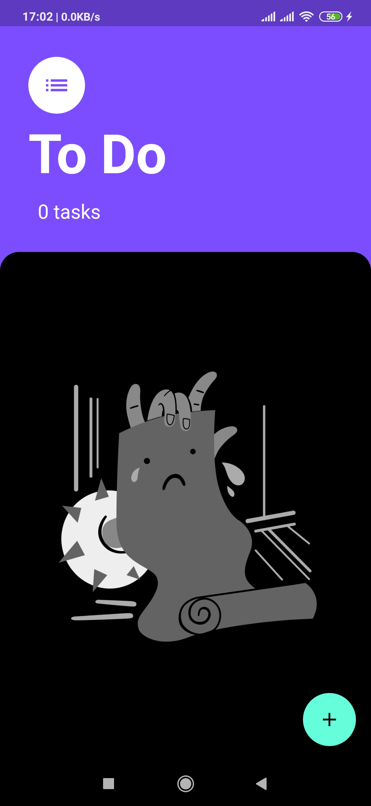
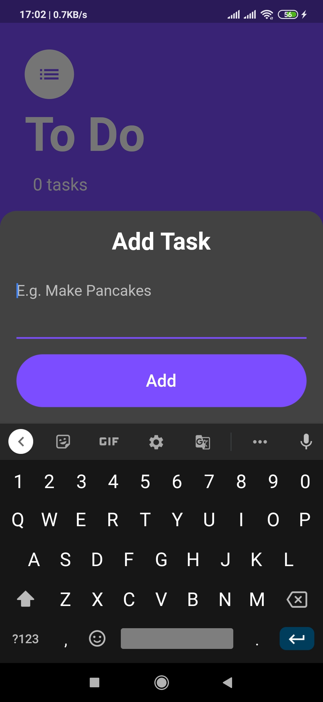
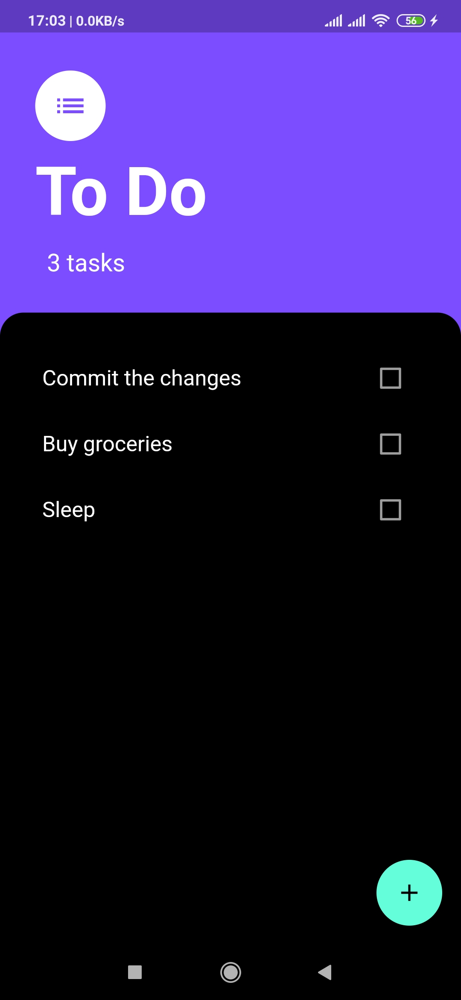
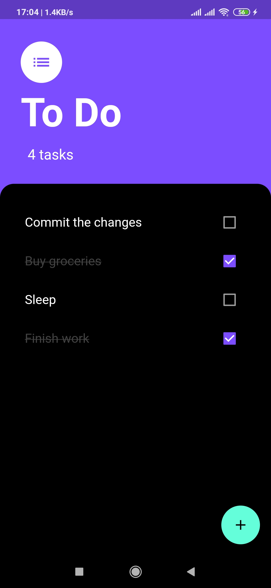
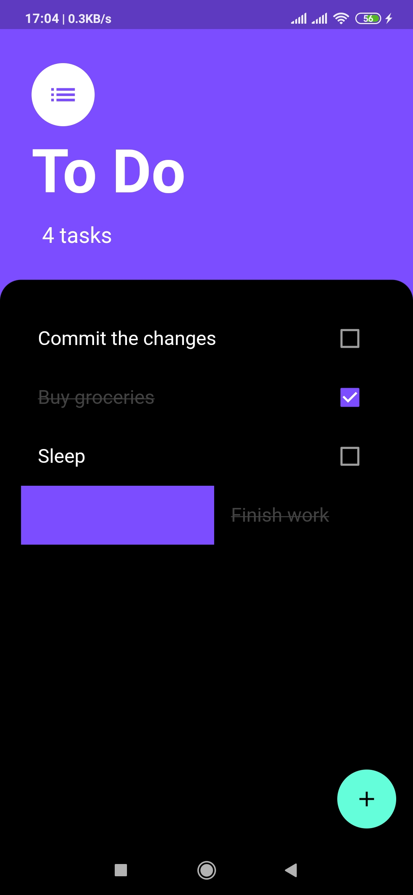

# todo_flutter

A minimal To-Do Flutter application. 

## Features

- Add Task
- Delete Task
    - Long Press
    - Swipe (Left/Right)
- Task Status, i.e. Number of pending tasks is shown at the top

